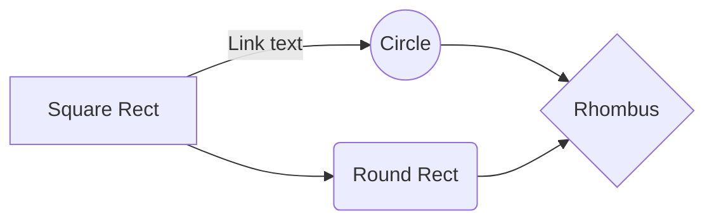

# go-math
Some math calculations using "github.com/gonum/stat" library. 

DockerHub image: hub.docker.com/r/twogghub/go-math/

And this will produce a flow chart:

```mermaid
graph LR
A[Square Rect] -- Link text --> B((Circle))
A --> C(Round Rect)
B --> D{Rhombus}
C --> D
```
